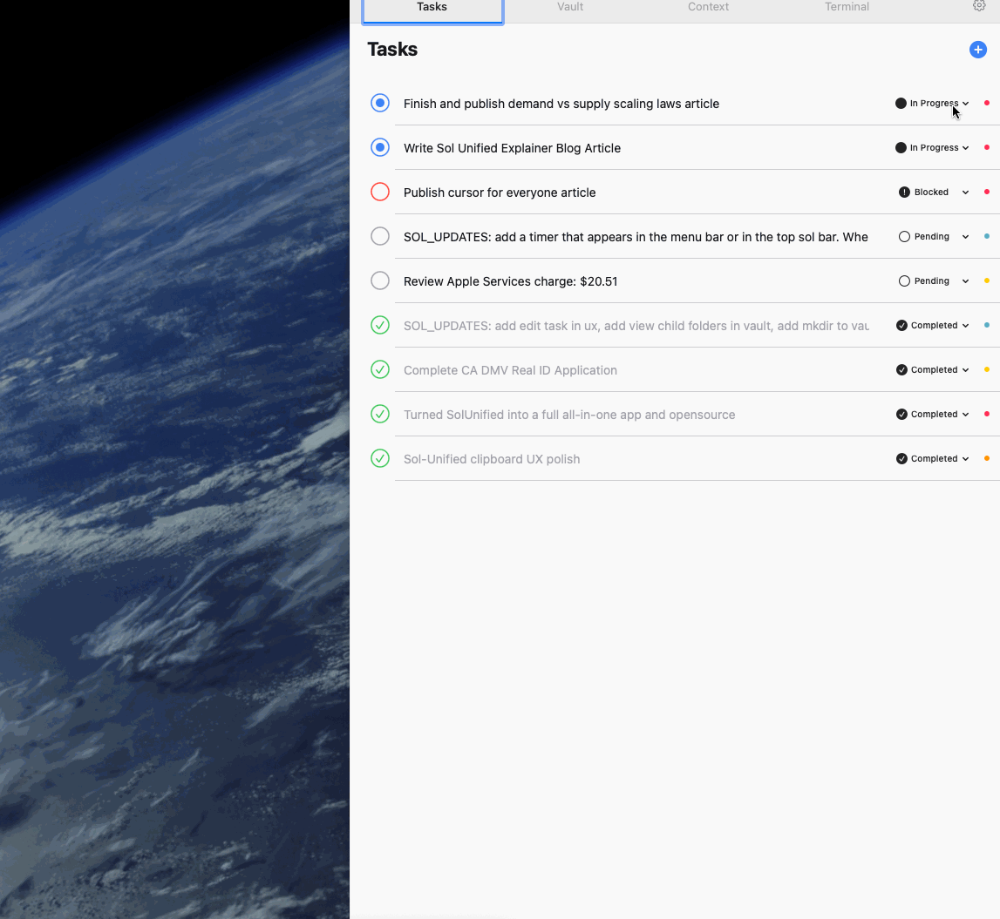

# Sol Unified

A native macOS app for unified personal context—clipboard, screenshots, activity tracking, notes, and terminal in one place. Built for vibe coders who want their AI agents to actually know what they're working on.



## Why Sol Unified?

The fundamental bottleneck in personal productivity isn't computation—it's **context**. 

Every time you switch apps, your brain has to reconstruct what you were doing. Every time you paste something into ChatGPT, you lose the surrounding context. Every time you search for "that screenshot from yesterday," you're paying a tax on your attention.

Sol Unified solves this by creating a **persistent, local context layer** that captures your work automatically:
- What you copied → Clipboard history with source app tracking
- What you saw → Screenshot archive with provenance metadata
- What you did → Activity log + **Context graph** (semantic work sessions)
- What you wrote → Markdown vault
- What you ran → Embedded terminal

Press `Option + p` and everything is right there. No more app switching. No more copy-paste archaeology.

---

## Features

### 📋 Clipboard History
- Automatic capture of text and images
- **Source app tracking** — Know where each item came from
- **Window title context** — See what window you copied from
- Searchable history with metadata
- Never lose what you copied

### 📸 Screenshots
- **Auto-detection** — Automatically scans for new screenshots
- **Provenance tracking** — Captures source app and window title
- Organized screenshot archive
- Quick search and retrieval
- Local AI tagging (coming soon)

### ⏱️ Activity Tracking
- **Unified Activity View** — Switch between raw events and semantic contexts
- **Context Graph** — Automatic detection of work sessions (deep work, exploration, communication, creative)
- Focus score tracking — See how focused you are in each session
- App usage analytics with time breakdown
- Idle-aware detection — Automatically pauses during breaks
- Data stays local—your privacy, your data

### 🧠 Context Graph
- **Automatic context detection** — Understands what you're working on semantically
- **Context types**: Deep work, exploration, communication, creative, administrative, leisure
- **Focus scoring** — Measures how focused you are (fewer app switches = higher focus)
- **Context transitions** — Visualize how you move between different work modes
- **Content linking** — Automatically links clipboard items, screenshots, and notes to active contexts
- **Timeline view** — See your work patterns over time

### 📚 Vault
- Browse and edit markdown files
- Folder-based organization
- WYSIWYG markdown editor
- Search across all files
- Collapsible sidebar (Cmd+Shift+B)

### 💻 Terminal
- Embedded terminal emulator (SwiftTerm)
- Full shell access (zsh/bash)
- Right alongside your context

### 📝 Tasks
- Simple task management
- Syncs with `agent_state.json` for AI agent integration
- Filter by status and priority

### 👥 People CRM (NEW)
- **Personal network management** — Track contacts with rich metadata
- **Organizations** — Link people to companies, schools, and other orgs
- **Connections** — Map relationships between people in your network
- **Network graph** — Force-directed visualization of your connections
- **Flexible tagging** — Organize contacts with custom tags
- **AI agent integration** — Ask "who do I know at [company]?" and get answers
- **Obsidian import** — Migrate from existing Obsidian CRM databases

### 🎨 Design
- Brutalist, information-dense UI
- Light and dark mode
- Global hotkey access (`Option + \``)
- Customizable window size

---

## Quick Start

### Prerequisites
- macOS 13.0 or later
- Swift 5.9+ (comes with Xcode)

### Installation

```bash
git clone https://github.com/sksareen/sol-unified.git
cd sol-unified
./run.sh
```

1. **Grant Accessibility permission** when prompted (required for global hotkey and activity tracking)
2. **Press `Option + \``** to show/hide the window

That's it.

### Build a DMG

```bash
./package.sh
```

Creates `SolUnified-v1.2.dmg` for distribution.

---

## Usage

### Global Hotkey
- **Option + P** (⌥P): Show/hide the app window

### Keyboard Shortcuts
| Shortcut | Action |
|----------|--------|
| `Cmd + 1` | Agent tab |
| `Cmd + 2` | Calendar tab |
| `Cmd + 3` | Notes tab |
| `Cmd + 4` | Tasks tab |
| `Cmd + 5` | People tab |
| `Cmd + 6` | Context tab |
| `Cmd + P` | Focus vault search |
| `Cmd + Shift + B` | Toggle vault sidebar |
| `Cmd + J` | Toggle terminal panel |
| `Cmd + ,` | Open Settings |
| `Cmd + =/-` | Resize window |
| `Esc` | Close modals |

---

## How It Works

Sol Unified creates a **shared state** architecture. Instead of every app being an island, it maintains a persistent context layer that any tool—including AI agents—can read.

### Data Storage

```
~/Library/Application Support/SolUnified/sol.db
```

Tables:
- `clipboard_history` — Text and images you've copied (with source app metadata)
- `screenshots` — Screenshot metadata and paths (with provenance tracking)
- `activity_log` — App usage and window tracking (with enhanced metadata)
- `context_nodes` — Work contexts and sessions (deep work, creative, etc.)
- `context_edges` — Relationships and transitions between contexts
- `notes` — Scratchpad and vault content
- `people` — Personal contacts with metadata
- `organizations` — Companies, schools, and other orgs
- `person_organizations` — Employment/education relationships
- `person_connections` — Person-to-person relationship links
- `person_tags` — Flexible tagging for contacts

### Agent Integration (Optional)

If you're building AI agents, Sol Unified can sync with `agent_state.json`:

```json
{
  "tasks": {
    "task_001": {
      "title": "Example task",
      "status": "pending",
      "priority": "high"
    }
  }
}
```

Place this at `~/Documents/agent_state.json` and Sol Unified will read/write to it.

---

## 🤖 AI Agent Integration (NEW)

Sol Unified now exposes your context to **any Claude Code instance** from **any terminal**.

### CLI Tool

```bash
# Install (already done during setup)
ln -sf /path/to/sol-unified/sol-context /usr/local/bin/sol-context

# Usage
sol-context                     # Quick summary of current context
sol-context clipboard 10        # Last 10 clipboard items
sol-context activity 4          # Last 4 hours of activity
sol-context search "README"     # Search across all context
sol-context stats               # Today's productivity stats
```

### HTTP API

When Sol Unified is running, a local API server is available:

```bash
curl http://localhost:7654/context      # Current work context
curl http://localhost:7654/clipboard    # Recent clipboard items
curl http://localhost:7654/activity     # Recent activity
curl http://localhost:7654/search?q=X   # Search all context
curl http://localhost:7654/health       # Server health check
```

### For Claude Code

Add this to your project's `CLAUDE.md`:

```markdown
## Context
To understand what I'm currently working on, run: sol-context
For detailed context: sol-context full
```

Now any Claude instance can understand:
- What you're currently working on (app, project, focus level)
- Recent clipboard items with source apps
- Activity patterns and context transitions
- Your productivity metrics

---

## Roadmap

### ✅ Phase 1: Core Context (Complete)
- [x] Clipboard history with source tracking
- [x] Screenshot organization with auto-detection
- [x] Activity tracking with enhanced metadata
- [x] Markdown vault
- [x] Embedded terminal
- [x] Global hotkey access
- [x] Task management

### ✅ Phase 2: Enhanced Context (v1.2)
- [x] **Context graph** — Automatic work session detection and visualization
- [x] **Focus scoring** — Measure focus quality per session
- [x] **Context transitions** — Track how you move between work modes
- [x] **Content linking** — Link clipboard/screenshots to contexts
- [x] **Idle-aware detection** — Smart pausing during breaks
- [x] **Performance optimizations** — Battery-efficient monitoring

### ✅ Phase 3: UX & Workflow (v1.3)
- [x] **Dynamic Vault Management** — Change vault roots without rebooting
- [x] **Daily Notes** — Automatic creation and opening of daily journal entries (Obsidian-style)
- [x] **Slide-out Terminal** — Terminal now opens as a panel from the bottom (Cmd+J), similar to Cursor/Zed
- [x] **Global Font Scaling** — Real-time font size adjustment (Cmd + =/-) across the app
- [x] **Unified Activity Log** — Streamlined activity stream merging semantic contexts and app sessions
- [x] **Performance UI** — Real-time rendering fixes and better Mac-native aesthetics

### ✅ Phase 4: Intelligence Layer (v1.4)
- [x] **AI Agent Tab** — Built-in Claude-powered assistant with tool use
- [x] **Agent Welcome Screen** — Example prompts and categories for first-time users
- [x] **People CRM** — Full personal network management with graph visualization
- [x] **Agent Tools** — 12 tools including calendar, contacts, memory, and people search
- [x] **Calendar Caching** — Smart lazy loading for better performance
- [x] **Privacy Controls** — Neural Context (screen capture) now opt-in

### 🔄 Phase 5: Advanced Intelligence (Next)
- [ ] **Smart search** — AI-powered search across all context types
- [ ] **Email capture** — Ingest and search email context
- [ ] **Browser integration** — Capture tabs and reading history
- [ ] **Automated tagging** — AI classification of all captured data
- [ ] **Workflow triggers** — Actions based on context patterns
- [ ] **Predictive context** — Suggest relevant contexts based on patterns

---

## Architecture

```
sol-unified/
├── SolUnified/
│   ├── App/                    # Entry point, window management
│   ├── Core/                   # Database, hotkeys, window manager
│   ├── Features/
│   │   ├── Agent/              # AI agent with Claude integration
│   │   ├── AgentContext/       # Context export for AI agents
│   │   ├── Calendar/           # Calendar integration with EventKit
│   │   ├── Clipboard/          # Clipboard monitoring
│   │   ├── Screenshots/        # Screenshot organization
│   │   ├── Activity/           # App/window tracking + Context graph
│   │   ├── Notes/              # Vault and markdown editor
│   │   ├── Terminal/           # SwiftTerm integration
│   │   ├── Tasks/              # Task management
│   │   ├── People/             # Personal CRM with network graph
│   │   └── Context/            # Unified context viewer
│   └── Shared/                 # Design system, models, settings
├── Package.swift
└── run.sh
```

**Tech Stack:**
- Swift 5.9+ / SwiftUI
- SQLite3 for local storage (WAL mode for performance)
- SwiftTerm for terminal
- Carbon API for global hotkeys
- Accessibility API for window/app tracking
- Event-driven architecture with optimized timers

---

## Troubleshooting

### Hotkey not working?
- System Settings → Privacy & Security → Accessibility → Add Sol Unified

### Activity log empty?
- System Settings → Privacy & Security → Input Monitoring → Add Sol Unified
- Enable activity logging in Settings (Cmd+,)

### Context graph not showing contexts?
- Make sure activity logging is enabled
- Switch between apps to generate context data
- Contexts are created automatically after 30 seconds of activity

### Build errors?
```bash
swift --version  # Need 5.9+
swift build
```

### People tab showing empty?
- People are stored locally in `sol.db`
- Use the + button to add contacts manually
- Import from Obsidian via Settings if you have an existing CRM database

### Agent not responding?
- Ensure you have a valid Claude API key in Settings
- Check your internet connection
- Review the error message in the chat

---

## Contributing

Contributions welcome! This is a personal project, but if you find it useful:

1. Fork the repo
2. Create a feature branch
3. Submit a PR

---

## License

MIT License - see [LICENSE](LICENSE)

---

## Credits

Built with inspiration from:
- [Raycast](https://raycast.com) — Command palette UX
- [Warp](https://warp.dev) — Terminal design
- [Obsidian](https://obsidian.md) — Vault concept

---

*This is a personal hobby project. Not affiliated with an employer.*
